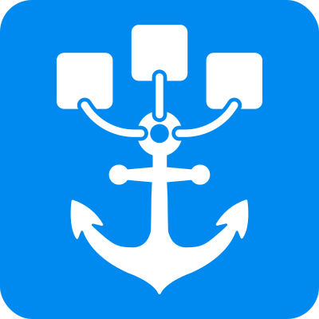

<p align="center">
  
</p>

# Coasts

Coasts (Containerized Hosts) is a CLI tool with a local observability UI for running multiple isolated instances of a full development environment on a single machine. It works out of the box with your current setup: no changes to your existing application code, just a small `Coastfile` at your repo root. If you already use Docker Compose, Coasts can boot from your existing `docker-compose.yml`; if you do not use Docker or Compose, Coasts works just as well.

Build once and run N instances with whatever volume and networking topology your project needs. Check out one coast at a time to bind canonical ports to your host, and use dynamic ports to peek into the progress of any worktree.

Coasts is agnostic to AI providers and agent harnesses. The only host requirement is Git worktrees, so you can switch tools without changing how you work and without any harness-specific environment setup.

Coasts is also offline-first with no hosted service dependency, so there is no vendor lock-in risk: even if we disappeared, your local workflow would keep running.

## Installation

Install the latest public release:

```sh
eval "$(curl -fsSL https://coasts.dev/install)"
```

[Visit coasts.dev](https://coasts.dev) for the website, docs, and installation instructions.


## Documentation

For the full user-facing documentation, see the [Coasts docs](https://coasts.dev/docs).

## Demo Repo

Want a concrete example to explore? Check out the [`coasts-demo` repository](https://github.com/coast-guard/coasts-demo) for a small demo project you can use to try Coasts end to end.

## Contributing

To contribute, read the [contributing guide](CONTRIBUTING.md) for PR guidelines.

> Note: Coasts is currently macOS-first. Linux development works, but canonical ports below `1024` require host setup before `coast checkout` can bind them.

### Prerequisites

- Rust (stable toolchain)
- Docker
- Node.js
- socat (`brew install socat` on macOS, `sudo apt install socat` on Ubuntu)
- Git

### Dev setup

Run the setup script once to build the web UI, compile the workspace, and symlink `coast-dev` / `coastd-dev` into `~/.local/bin`:

```bash
./dev_setup.sh
```

On first run it adds `~/.local/bin` to your PATH — restart your shell or `source ~/.zshrc` to pick it up.

Dev mode uses `~/.coast-dev/` and port 31416, so it never conflicts with a global coast install on port 31415.

### Day-to-day development workflow

You'll want three terminals:

**Terminal 1 — dev daemon:**

```bash
coast-dev daemon start        # start in background
# or: coastd-dev --foreground # start in foreground for log output
```

After Rust changes are rebuilt by `make watch`, restart the daemon to pick them up:

```bash
coast-dev daemon restart
```

**Terminal 2 — Rust rebuild on save:**

```bash
make watch
```

This runs `cargo watch` and recompiles the workspace whenever Rust source files change. After a rebuild completes, restart the daemon in Terminal 1.

**Terminal 3 — web UI with hot reload:**

```bash
cd coast-guard
npm install
npm run dev:coast-dev
```

This starts the Vite dev server on `http://localhost:5173` with hot module replacement, proxying `/api` requests to the dev daemon at `localhost:31416`.

> Use `npm run dev` (without `:coast-dev`) if you're developing the UI against a production daemon on port 31415.

### Makefile targets

The [Makefile](Makefile) is the primary entry point for development tasks:

| Command | What it does |
|---------|-------------|
| `make lint` | Check formatting (`cargo fmt --check`) and run `cargo clippy` |
| `make fix` | Auto-format and auto-fix clippy warnings |
| `make test` | Run the full unit test suite across all workspace crates |
| `make check` | `make lint` + `make test` in sequence |
| `make coverage` | Generate an HTML coverage report and open it |
| `make watch` | Rebuild on source changes (requires `cargo-watch`) |

### Coast Guard (web UI)

#### Generating TypeScript types

The web UI depends on TypeScript types generated from Rust structs via `ts-rs`. After changing any Rust types that are used by the UI, regenerate the bindings:

```bash
cd coast-guard
npm run generate:types
```

This runs `cargo test -p coast-core export_bindings` and rebuilds the barrel file in `src/types/generated/`.

#### Generating the docs manifest

The docs viewer in the UI reads from a generated manifest. After changing any markdown files in `docs/`, regenerate it:

```bash
cd coast-guard
npm run generate:docs
```

### Docs localization and search indexes

Translation and search index generation are centralized Python scripts invoked via the Makefile:

```bash
make docs-status                      # show which docs need translation
make translate LOCALE=es              # translate docs for one locale
make translate-all                    # translate all supported locales
make doc-search LOCALE=en             # generate search index for one locale
make doc-search-all                   # generate search indexes for all locales
```

Both scripts read `OPENAI_API_KEY` from the environment or from `.env` in the project root. See `.env.example`.

## Testing

### Unit tests

```bash
make test
```

Runs `cargo test --workspace` across all crates.

### Integration tests

Integration tests live in `integrated-examples/` and exercise full end-to-end coast workflows. They are useful for validating real behavior but come with practical costs: they require Docker running, socat installed, and a release build. Each test spins up real DinD containers, so a full run can consume significant disk space and you may need to `docker system prune` periodically to reclaim it.

For the full list of tests, prerequisites, and cleanup guidance, see the [integrated-examples README](integrated-examples/README.md).

Quick usage:

```bash
integrated-examples/test.sh                            # run all tests
integrated-examples/test.sh test_checkout test_secrets  # run specific tests
integrated-examples/test.sh --include-keychain          # include macOS Keychain test
```

## Project Structure

```
coast/
  coast-cli/          # Thin CLI client, talks to daemon over unix socket
  coast-daemon/       # coastd background process (handlers, state DB, port manager)
  coast-core/         # Shared types, Coastfile parsing, protocol definitions
  coast-secrets/      # Secret extraction, encryption, keystore
  coast-docker/       # Docker API wrapper, DinD runtime, compose interaction
  coast-git/          # Git worktree management
  coast-guard/        # Web UI (React + Vite), served by the daemon
  coast-i18n/         # i18n locale files for the CLI
  scripts/            # Python build scripts (translation, search index generation)
  docs/               # User-facing documentation (English + translations)
  integrated-examples/  # Example projects and shell-based integration tests
```

## Building from source

```bash
cargo build --release
```

Binaries are placed in `target/release/`:
- `coast` -- the CLI client
- `coastd` -- the background daemon

```bash
# Start the daemon
coastd --foreground &

# In a project with a Coastfile and docker-compose.yml:
coast build
coast run main
coast run feature-x --worktree feature/x

# Swap which instance owns the canonical ports
coast checkout main
coast checkout feature-x

# Inspect
coast ls
coast ps main
coast logs main
coast ports main

# Clean up
coast rm main
coast rm feature-x
```

## Contributors

- [@jamiesunderland](https://github.com/jamiesunderland)
- [@dahyman91](https://github.com/dahyman91)
- [@agustif](https://github.com/agustif)
- [@clarkerican](https://github.com/clarkerican)
- [@mukeshblackhat](https://github.com/mukeshblackhat)
- [@gregpeden](https://github.com/GregPeden)

## Original History


This project started in another repository and had some of its history squashed. Please see the [original repo here](https://github.com/jsx-tool/coasts) for the full commit history.
