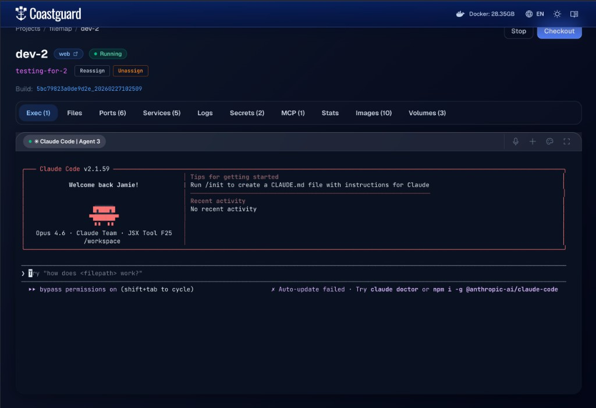

# Agent Shells

Agent shells are shells inside a Coast that open directly to an agent TUI runtime — Claude Code, Codex, or any CLI agent. You configure them with an `[agent_shell]` section in your Coastfile and Coast spawns the agent process inside the DinD container.

**For most use cases, you should not do this.** Run your coding agents on the host machine instead. The shared [filesystem](FILESYSTEM.md) means a host-side agent can edit code normally while calling [`coast logs`](LOGS.md), [`coast exec`](EXEC_AND_DOCKER.md), and [`coast ps`](RUNTIMES_AND_SERVICES.md) for runtime information. Agent shells add credential mounting, OAuth complications, and lifecycle complexity that you do not need unless you have a specific reason to containerize the agent itself.

## The OAuth Problem

If you are using Claude Code, Codex, or similar tools that authenticate via OAuth, the token was issued for your host machine. When that same token is used from inside a Linux container — different user agent, different environment — the provider may flag or revoke it. You will get intermittent authentication failures that are difficult to debug.

For containerized agents, API-key-based authentication is the safer choice. Set the key as a [secret](SECRETS.md) in your Coastfile and inject it into the container environment.

If API keys are not an option, you can mount OAuth credentials into the Coast (see the Configuration section below), but expect friction. On macOS, if you use the `keychain` secret extractor to pull OAuth tokens, every `coast build` will prompt for your macOS Keychain password. This makes the build process tedious, especially when rebuilding frequently. The Keychain prompt is a macOS security requirement and cannot be bypassed.

## Configuration

Add an `[agent_shell]` section to your Coastfile with the command to run:

```toml
[agent_shell]
command = "claude --dangerously-skip-permissions"
```

The command is executed inside the DinD container at `/workspace`. Coast creates a `coast` user inside the container, copies credentials from `/root/.claude/` to `/home/coast/.claude/`, and runs the command as that user. If your agent needs credentials mounted into the container, use `[secrets]` with file injection (see [Secrets and Extractors](SECRETS.md)) and `[coast.setup]` to install the agent CLI:

```toml
[coast.setup]
run = ["npm install -g @anthropic-ai/claude-code"]

[secrets.claude_credentials]
extractor = "keychain"
service = "Claude Code-credentials"
inject = "file:/root/.claude/.credentials.json"

[agent_shell]
command = "claude --dangerously-skip-permissions"
```

If `[agent_shell]` is configured, Coast auto-spawns a shell when the instance starts. The configuration is inherited via `extends` and can be overridden per [Coastfile type](COASTFILE_TYPES.md).

## The Active Agent Model

Each Coast instance can have multiple agent shells, but only one is **active** at a time. The active shell is the default target for commands that do not specify a `--shell` ID.

```bash
coast agent-shell dev-1 ls

  SHELL  STATUS   ACTIVE
  1      running  ★
  2      running
```

Switch the active shell:

```bash
coast agent-shell dev-1 activate 2
```

You cannot close the active shell — activate a different one first. This prevents accidentally killing the shell you are interacting with.

In Coastguard, agent shells appear as tabs in the Exec panel with active/inactive badges. Click a tab to view its terminal; use the dropdown menu to activate, spawn, or close shells.


*An agent shell running Claude Code inside a Coast instance, accessible from the Exec tab in Coastguard.*

## Sending Input

The primary way to drive a containerized agent programmatically is `coast agent-shell input`:

```bash
coast agent-shell dev-1 input "fix the failing test in auth.test.ts"
```

This writes the text to the active agent's TUI and presses Enter. The agent receives it as if you typed it into the terminal.

Options:

- `--no-send` — write the text without pressing Enter. Useful for building up partial input or navigating TUI menus.
- `--shell <id>` — target a specific shell instead of the active one.
- `--show-bytes` — print the exact bytes being sent, for debugging.

Under the hood, input is written directly to the PTY master file descriptor. The text and Enter keystroke are sent as two separate writes with a 25ms gap to avoid paste-mode artifacts that some TUI frameworks exhibit when receiving rapid input.

## Other Commands

```bash
coast agent-shell dev-1 spawn              # create a new shell
coast agent-shell dev-1 spawn --activate   # create and immediately activate
coast agent-shell dev-1 tty                # attach interactive TTY to active shell
coast agent-shell dev-1 tty --shell 2      # attach to a specific shell
coast agent-shell dev-1 read-output        # read full scrollback buffer
coast agent-shell dev-1 read-last-lines 50 # read last 50 lines of output
coast agent-shell dev-1 session-status     # check if the shell process is alive
```

`tty` gives you a live interactive session — you can type directly into the agent's TUI. Detach with the standard terminal escape sequence. `read-output` and `read-last-lines` are non-interactive and return text, which is useful for scripting and automation.

## Lifecycle and Recovery

Agent shell sessions persist in Coastguard across page navigation. The scrollback buffer (up to 512KB) is replayed when you reconnect to a tab.

When you stop a Coast instance with `coast stop`, all agent shell PTY processes are killed and their database records are cleaned up. `coast start` auto-spawns a fresh agent shell if `[agent_shell]` is configured.

After a daemon restart, previously running agent shells will show as dead. The system detects this automatically — if the active shell is dead, the first live shell is promoted to active. If no shells are alive, spawn a new one with `coast agent-shell spawn --activate`.

## Who This Is For

Agent shells are designed for **products building first-party integrations** around Coasts — orchestration platforms, agent wrappers, and tools that want to manage containerized coding agents programmatically via the `input`, `read-output`, and `session-status` APIs.

For general-purpose parallel agent coding, run agents on the host. It is simpler, avoids OAuth issues, sidesteps credential mounting complexity, and takes full advantage of the shared filesystem. You get all the benefits of Coast (isolated runtimes, port management, worktree switching) without any of the agent containerization overhead.

The next level of complexity beyond agent shells is mounting [MCP servers](MCP_SERVERS.md) into the Coast so the containerized agent has access to tools. This compounds the integration surface further and is covered separately. The capability is there if you need it, but most users should not.
