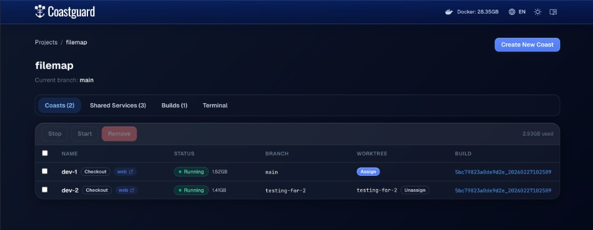
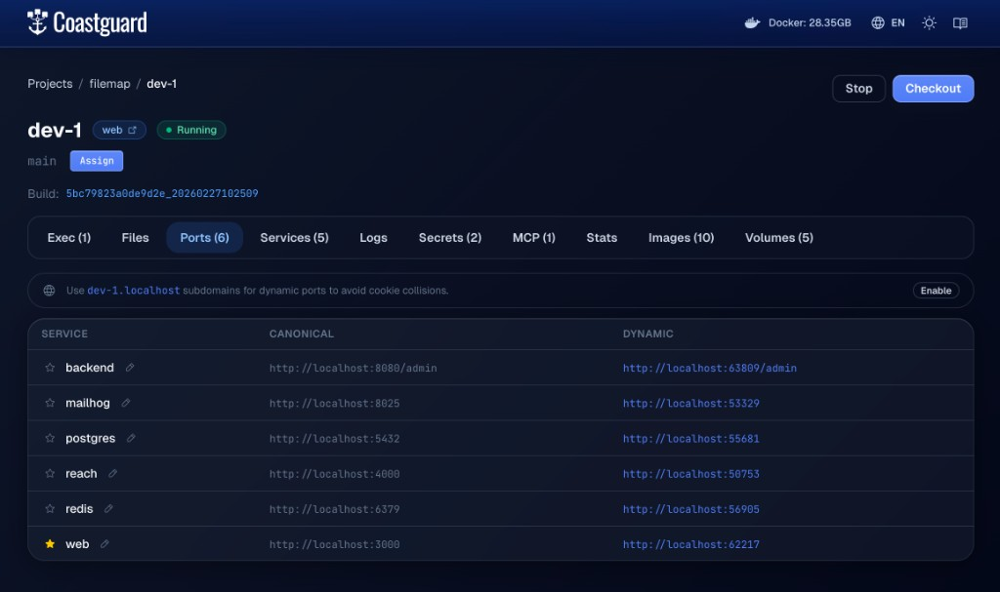

# Coastguard

Coastguard is Coast's local web UI (think: Coast's Docker Desktop-style interface), running on port `31415`. It is launched from the CLI:

```bash
coast ui
```


*The project dashboard showing running Coast instances, their branches/worktrees, and checkout state.*


*The ports page for a specific Coast instance, showing canonical and dynamic port mappings for each service.*

## What Coastguard Is Good For

Coastguard gives you a visual control and observability surface for your project:

- See projects, instances, statuses, branches, and checkout state.
- Inspect [port mappings](PORTS.md) and jump directly into services.
- View [logs](LOGS.md), runtime stats, and inspect data.
- Browse [builds](BUILDS.md), image artifacts, [volumes](VOLUMES.md), and [secrets](SECRETS.md) metadata.
- Navigate docs in-app while working.

## Relationship to CLI and Daemon

Coastguard does not replace the CLI. It complements it as the human-facing interface.

- [`coast` CLI](CLI.md) is the automation interface for scripts, agent workflows, and tooling integrations.
- Coastguard is the human interface for visual inspection, interactive debugging, and day-to-day operational visibility.
- Both are clients of [`coastd`](DAEMON.md), so they stay in sync.

