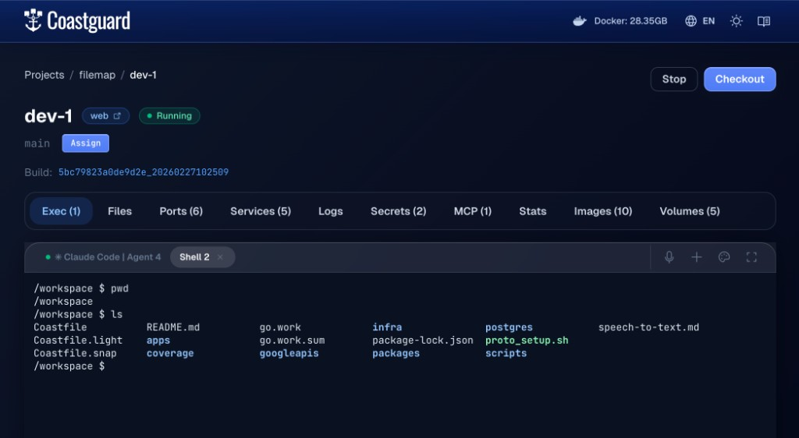

# Exec & Docker

`coast exec` drops you into a shell inside the Coast's DinD container. Your working directory is `/workspace` — the [bind-mounted project root](FILESYSTEM.md) where your Coastfile lives. This is the primary way to run commands, inspect files, or debug services inside a Coast from your host machine.

`coast docker` is the companion command for talking to the inner Docker daemon directly.

## `coast exec`

Open a shell inside a Coast instance:

```bash
coast exec dev-1
```

This starts an `sh` session at `/workspace`. Coast containers are Alpine-based, so the default shell is `sh`, not `bash`.

You can also run a specific command without entering an interactive shell:

```bash
coast exec dev-1 ls -la
coast exec dev-1 -- npm install
coast exec dev-1 -- go test ./...
```

Everything after the instance name is passed as the command. Use `--` to separate flags that belong to your command from flags that belong to `coast exec`.

### Working Directory

The shell starts at `/workspace`, which is your host project root bind-mounted into the container. This means your source code, Coastfile, and all project files are right there:

```text
/workspace $ ls
Coastfile       README.md       apps/           packages/
Coastfile.light go.work         infra/          scripts/
Coastfile.snap  go.work.sum     package-lock.json
```

Any changes you make to files under `/workspace` are reflected on the host immediately — it is a bind mount, not a copy.

### Interactive vs Non-Interactive

When stdin is a TTY (you are typing at a terminal), `coast exec` bypasses the daemon entirely and runs `docker exec -it` directly for full TTY passthrough. This means colors, cursor movement, tab completion, and interactive programs all work as expected.

When stdin is piped or scripted (CI, agent workflows, `coast exec dev-1 -- some-command | grep foo`), the request goes through the daemon and returns structured stdout, stderr, and an exit code.

### File Permissions

The exec runs as your host user's UID:GID, so files created inside the Coast have the correct ownership on the host. No permission mismatches between host and container.

## `coast docker`

While `coast exec` gives you a shell in the DinD container itself, `coast docker` lets you run Docker CLI commands against the **inner** Docker daemon — the one managing your compose services.

```bash
coast docker dev-1                    # defaults to: docker ps
coast docker dev-1 ps                 # same as above
coast docker dev-1 compose ps         # docker compose ps (inner services)
coast docker dev-1 images             # list images in the inner daemon
coast docker dev-1 compose logs web   # docker compose logs for a service
```

Every command you pass is prefixed with `docker` automatically. So `coast docker dev-1 compose ps` runs `docker compose ps` inside the Coast container, talking to the inner daemon.

### `coast exec` vs `coast docker`

The distinction is what you are targeting:

| Command | Runs as | Target |
|---|---|---|
| `coast exec dev-1 ls /workspace` | `sh -c "ls /workspace"` in DinD container | The Coast container itself (your project files, installed tools) |
| `coast docker dev-1 ps` | `docker ps` in DinD container | The inner Docker daemon (your compose service containers) |
| `coast docker dev-1 compose logs web` | `docker compose logs web` in DinD container | A specific compose service's logs via the inner daemon |

Use `coast exec` for project-level work — running tests, installing dependencies, inspecting files. Use `coast docker` when you need to see what the inner Docker daemon is doing — container status, images, networks, compose operations.

## Coastguard Exec Tab

The Coastguard web UI provides a persistent interactive terminal connected over WebSocket.


*The Coastguard Exec tab showing a shell session at /workspace inside a Coast instance.*

The terminal is powered by xterm.js and offers:

- **Persistent sessions** — terminal sessions survive page navigation and browser refreshes. Reconnecting replays the scrollback buffer so you pick up where you left off.
- **Multiple tabs** — open several shells at once. Each tab is an independent session.
- **[Agent shell](AGENT_SHELLS.md) tabs** — spawn dedicated agent shells for AI coding agents, with active/inactive status tracking.
- **Fullscreen mode** — expand the terminal to fill the screen (Escape to exit).

Beyond the instance-level exec tab, Coastguard also provides terminal access at other levels:

- **Service exec** — click into an individual service from the Services tab to get a shell inside that specific inner container (this does a double `docker exec` — first into the DinD container, then into the service container).
- **[Shared service](SHARED_SERVICES.md) exec** — get a shell inside a host-level shared service container.
- **Host terminal** — a shell on your host machine at the project root, without entering a Coast at all.

## When to Use Which

- **`coast exec`** — run project-level commands (npm install, go test, file inspection, debugging) inside the DinD container.
- **`coast docker`** — inspect or manage the inner Docker daemon (container status, images, networks, compose operations).
- **Coastguard Exec tab** — interactive debugging with persistent sessions, multiple tabs, and agent shell support. Best when you want to keep several terminals open while navigating the rest of the UI.
- **`coast logs`** — for reading service output, use `coast logs` instead of `coast docker compose logs`. See [Logs](LOGS.md).
- **`coast ps`** — for checking service status, use `coast ps` instead of `coast docker compose ps`. See [Runtimes and Services](RUNTIMES_AND_SERVICES.md).
