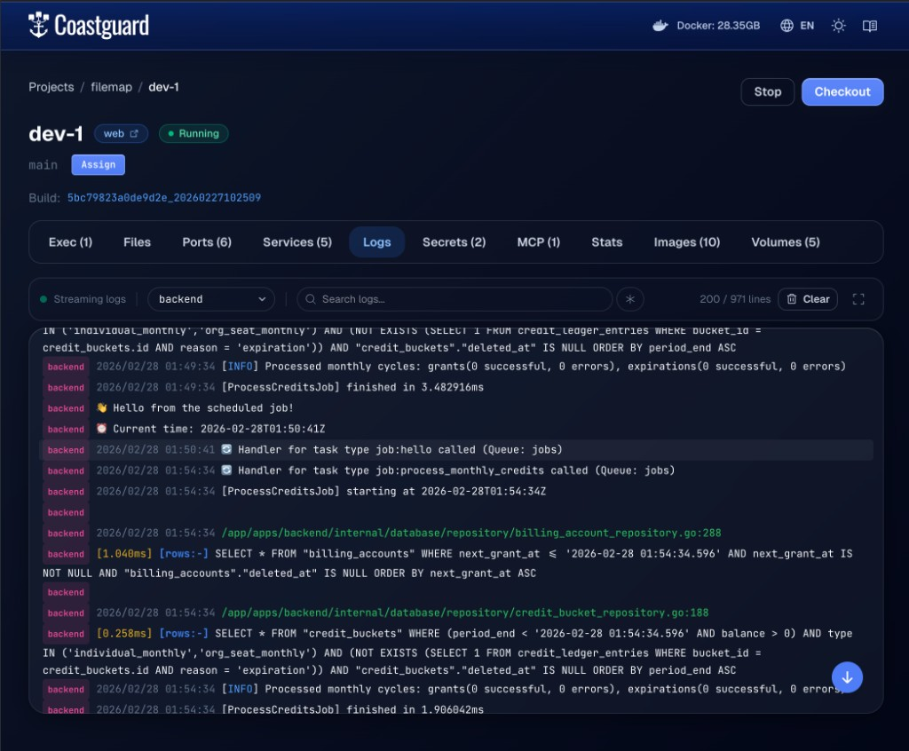

# Logs

Services inside a Coast run in nested containers — your compose services are managed by an inner Docker daemon inside a DinD container. This means host-level logging tools cannot see them. If your workflow includes a logging MCP that reads Docker logs on the host, it will only see the outer DinD container, not the web server, database, or worker running inside it.

The solution is `coast logs`. Any agent or tool that needs to read service output from a Coast instance must use the Coast CLI instead of host-level Docker log access.

## The MCP Tradeoff

If you are using an AI agent with a logging MCP (a tool that captures Docker container logs from your host — see [MCP Servers](MCP_SERVERS.md)), that MCP will not work for services running inside a Coast. The host Docker daemon sees one container per Coast instance — the DinD container — and its logs are just the inner Docker daemon's startup output.

To capture the actual service logs, instruct your agent to use:

```bash
coast logs <instance> --service <service> --tail <lines>
```

For example, if your agent needs to inspect why a backend service is failing:

```bash
coast logs dev-1 --service backend --tail 100
```

This is the equivalent of `docker compose logs` but routed through the Coast daemon into the inner DinD container. If you have agent rules or system prompts that reference a logging MCP, you will need to add an instruction that overrides this behavior when working inside a Coast.

## `coast logs`

The CLI provides several ways to read logs from a Coast instance:

```bash
coast logs dev-1                           # last 200 lines, all services
coast logs dev-1 --service web             # last 200 lines, web only
coast logs dev-1 --tail 50                 # last 50 lines, then follow
coast logs dev-1 --tail                    # all lines, then follow
coast logs dev-1 --service backend -f      # follow mode (stream new entries)
coast logs dev-1 --service web --tail 100  # last 100 lines + follow
```

Without `--tail` or `-f`, the command returns the last 200 lines and exits. With `--tail`, it streams the requested number of lines and then continues following new output in real time. `-f` / `--follow` enables follow mode on its own.

The output uses the compose log format with a service prefix on each line:

```text
web       | 2026/02/28 01:49:34 Listening on :3000
backend   | 2026/02/28 01:49:34 [INFO] Server started on :8080
backend   | 2026/02/28 01:49:34 [ProcessCreditsJob] starting at 2026-02-28T01:49:34Z
redis     | 1:M 28 Feb 2026 01:49:30.123 * Ready to accept connections
```

You can also filter by service with the legacy positional syntax (`coast logs dev-1 web`), but the `--service` flag is preferred.

## Coastguard Logs Tab

The Coastguard web UI provides a richer log viewing experience with real-time streaming over WebSocket.


*The Coastguard Logs tab streaming backend service output with service filtering and search.*

The Logs tab offers:

- **Real-time streaming** — logs arrive over a WebSocket connection as they are produced, with a status indicator showing connection state.
- **Service filter** — a dropdown populated from the log stream's service prefixes. Select a single service to focus on its output.
- **Search** — filter displayed lines by text or regex (toggle the asterisk button for regex mode). Matching terms are highlighted.
- **Line counts** — shows filtered lines vs total lines (e.g. "200 / 971 lines").
- **Clear** — truncates the inner container log files and resets the viewer.
- **Fullscreen** — expand the log viewer to fill the screen.

Log lines are rendered with ANSI color support, log level highlighting (ERROR in red, WARN in amber, INFO in blue, DEBUG in gray), timestamp dimming, and colored service badges for visual distinction between services.

Shared services running on the host daemon have their own log viewer accessible from the Shared Services tab. See [Shared Services](SHARED_SERVICES.md) for details.

## How It Works

When you run `coast logs`, the daemon executes `docker compose logs` inside the DinD container via `docker exec` and streams the output back to your terminal (or to the Coastguard UI over WebSocket).

```text
coast logs dev-1 --service web --tail 50
  │
  ├── CLI sends LogsRequest to daemon (Unix socket)
  │
  ├── Daemon resolves instance → container ID
  │
  ├── Daemon exec's into DinD container:
  │     docker compose logs --tail 50 --follow web
  │
  └── Output streams back chunk by chunk
        └── CLI prints to stdout / Coastguard renders in UI
```

For [bare services](BARE_SERVICES.md), the daemon tails the log files at `/var/log/coast-services/` instead of calling `docker compose logs`. The output format is the same (`service  | line`) so service filtering works identically in both cases.

## Related Commands

- `coast ps <instance>` — check which services are running and their status. See [Runtimes and Services](RUNTIMES_AND_SERVICES.md).
- [`coast exec <instance>`](EXEC_AND_DOCKER.md) — open a shell inside the Coast container for manual debugging.
