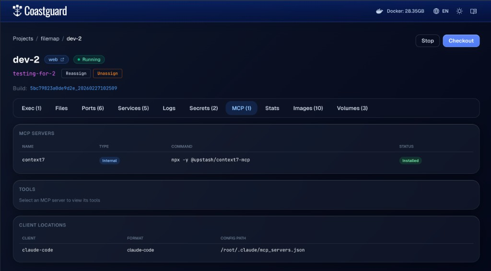

# MCP Servers

MCP (Model Context Protocol) servers give AI agents access to tools — file search, database queries, documentation lookup, browser automation, and more. Coast can install and configure MCP servers inside a Coast container so that a containerized agent has access to the tools it needs.

**This is only relevant if you are running your agent inside the Coast container.** If you run agents on the host (the recommended approach), your MCP servers run on the host too and none of this configuration is needed. This page builds on [Agent Shells](AGENT_SHELLS.md) and adds another layer of complexity on top of it. Read the warnings there before proceeding.

## Internal vs Host-Proxied Servers

Coast supports two modes for MCP servers, controlled by the `proxy` field in the `[mcp]` section of your Coastfile.

### Internal Servers

Internal servers are installed and run inside the DinD container at `/mcp/<name>/`. They have direct access to the containerized filesystem and the running services.

```toml
[mcp.context7]
install = "npm install -g @upstash/context7-mcp"
command = "npx"
args = ["-y", "@upstash/context7-mcp"]
```

You can also copy source files from your project into the MCP directory:

```toml
[mcp.my-custom-tool]
source = "tools/my-mcp-server"
install = ["npm install", "npm run build"]
command = "node"
args = ["dist/index.js"]
```

The `source` field copies files from `/workspace/<path>/` to `/mcp/<name>/` during setup. The `install` commands run inside that directory. This is useful for MCP servers that live in your repository.

### Host-Proxied Servers

Host-proxied servers run on your host machine, not inside the container. Coast generates a client config that uses `coast-mcp-proxy` to forward MCP requests from the container to the host over the network.

```toml
[mcp.browser]
proxy = "host"
command = "npx"
args = ["@anthropic-ai/browser-mcp"]
```

Host-proxied servers cannot have `install` or `source` fields — they are expected to already be available on the host. Use this mode for MCP servers that need host-level access, such as browser automation or host filesystem tools.

### When to Use Which

| Mode | Runs in | Good for | Limitations |
|---|---|---|---|
| Internal | DinD container | Tools that need container filesystem access, project-specific tools | Must be installable in Alpine Linux, adds to `coast run` time |
| Host-proxied | Host machine | Browser automation, host-level tools, large pre-installed servers | Cannot access container filesystem directly |

## Client Connectors

The `[mcp_clients]` section tells Coast where to write the generated MCP server configuration so the agent inside the container can discover the servers.

### Built-in Formats

For Claude Code and Cursor, an empty section with the right name is enough — Coast auto-detects the format and default config path:

```toml
[mcp_clients.claude-code]
# Writes to /root/.claude/mcp_servers.json (auto-detected)

[mcp_clients.cursor]
# Writes to /workspace/.cursor/mcp.json (auto-detected)
```

### Custom Config Path

For other AI tools, specify the format and path explicitly:

```toml
[mcp_clients.my-tool]
format = "claude-code"
config_path = "/home/coast/.config/my-tool/mcp.json"
```

### Command-Based Connectors

Instead of writing a file, you can pipe the generated config JSON to a command:

```toml
[mcp_clients.custom-setup]
run = "my-config-tool import-mcp --stdin"
```

The `run` field is mutually exclusive with `format` and `config_path`.

## Coastguard MCP Tab

The [Coastguard](COASTGUARD.md) web UI provides visibility into your MCP configuration from the MCP tab.


*The Coastguard MCP tab showing configured servers, their tools, and client config locations.*

The tab has three sections:

- **MCP Servers** — lists each declared server with its name, type (Internal or Host), command, and status (Installed, Proxied, or Not Installed).
- **Tools** — select a server to inspect the tools it exposes via the MCP protocol. Each tool shows its name and description; click through for the full input schema.
- **Client Locations** — shows where the generated config files were written (e.g., `claude-code` format at `/root/.claude/mcp_servers.json`).

## CLI Commands

```bash
coast mcp dev-1 ls                          # list servers with type and status
coast mcp dev-1 tools context7              # list tools exposed by a server
coast mcp dev-1 tools context7 info resolve # show input schema for a specific tool
coast mcp dev-1 locations                   # show where client configs were written
```

The `tools` command works by sending JSON-RPC `initialize` and `tools/list` requests to the MCP server process inside the container. It only works for internal servers — host-proxied servers must be inspected from the host.

## How Installation Works

During `coast run`, after the inner Docker daemon is ready and services are starting, Coast sets up MCP:

1. For each **internal** MCP server:
   - Creates `/mcp/<name>/` inside the DinD container
   - If `source` is set, copies files from `/workspace/<source>/` into `/mcp/<name>/`
   - Runs each `install` command inside `/mcp/<name>/` (e.g., `npm install -g @upstash/context7-mcp`)

2. For each **client connector**:
   - Generates the JSON config in the appropriate format (Claude Code or Cursor)
   - Internal servers get their actual `command` and `args` with `cwd` set to `/mcp/<name>/`
   - Host-proxied servers get `coast-mcp-proxy` as the command with the server name as the argument
   - Writes the config to the target path (or pipes it to the `run` command)

Host-proxied servers rely on `coast-mcp-proxy` inside the container to forward MCP protocol requests back to the host machine, where the actual MCP server process runs.

## Full Example

A Coastfile that sets up an internal documentation tool and a host-proxied browser tool, wired into Claude Code:

```toml
[mcp.context7]
install = "npm install -g @upstash/context7-mcp"
command = "npx"
args = ["-y", "@upstash/context7-mcp"]

[mcp.browser]
proxy = "host"
command = "npx"
args = ["@anthropic-ai/browser-mcp"]

[mcp_clients.claude-code]
```

After `coast run`, Claude Code inside the container sees both servers in its MCP config — `context7` running locally at `/mcp/context7/` and `browser` proxied to the host.

## Agents Running on the Host

If your coding agent runs on the host machine (the recommended approach), your MCP servers also run on the host and Coast's `[mcp]` configuration is not involved. However, there is one thing to consider: **MCP servers that connect to databases or services inside a Coast need to know the right port.**

When services run inside a Coast, they are accessible on dynamic ports that change each time you run a new instance. A database MCP on the host that connects to `localhost:5432` will only reach the [checked-out](CHECKOUT.md) Coast's database — or nothing at all if no Coast is checked out. For non-checked-out instances, you would need to reconfigure the MCP to use the [dynamic port](PORTS.md) (e.g., `localhost:55681`).

There are two ways around this:

**Use shared services.** If your database runs as a [shared service](SHARED_SERVICES.md), it lives on the host Docker daemon at its canonical port (`localhost:5432`). Every Coast instance connects to it over a bridge network, and your host-side MCP connects to the same database at the same port it always has. No reconfiguration needed, no dynamic port discovery. This is the simplest approach.

**Use `coast exec` or `coast docker`.** If your database runs inside the Coast (isolated volumes), your host-side agent can still query it by running commands through Coast (see [Exec & Docker](EXEC_AND_DOCKER.md)):

```bash
coast exec dev-1 -- psql -h localhost -U myuser -d mydb -c "SELECT count(*) FROM users"
coast docker dev-1 exec -i my-postgres psql -U myuser -d mydb -c "\\dt"
```

This avoids needing to know the dynamic port at all — the command runs inside the Coast where the database is at its canonical port.

For most workflows, shared services are the path of least resistance. Your host MCP configuration stays exactly the same as it was before you started using Coasts.
