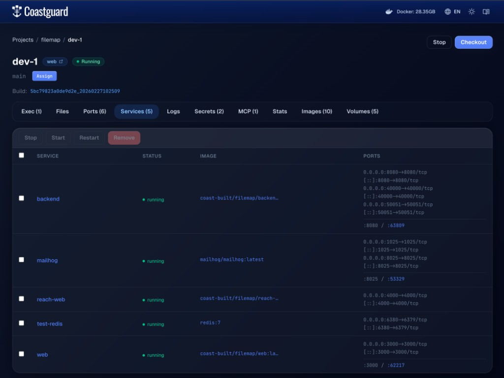

# Runtimes and Services

A Coast runs inside a container runtime — an outer container that hosts its own Docker (or Podman) daemon. Your project's services run inside that inner daemon, completely isolated from other Coast instances. Currently, **DinD (Docker-in-Docker) is the only production-tested runtime.** At this time we advise you stick with DinD until Podman and Sysbox support has been thoroughly tested.

## Runtimes

The `runtime` field in your Coastfile selects which container runtime backs the Coast. The default is `dind` and you can omit it entirely:

```toml
[coast]
name = "my-app"
runtime = "dind"
```

Three values are accepted: `dind`, `sysbox`, and `podman`. In practice, only DinD is wired into the daemon and has been tested end-to-end.

### DinD (Docker-in-Docker)

The default and only runtime you should use today. Coast creates a container from the `docker:dind` image with `--privileged` mode enabled. Inside that container, a full Docker daemon starts up and your `docker-compose.yml` services run as nested containers.

DinD is fully integrated:

- Images are pre-cached on the host and loaded into the inner daemon on `coast run`
- Per-instance images are built on the host and piped in via `docker save | docker load`
- The inner daemon's state is persisted in a named volume (`coast-dind--{project}--{instance}`) at `/var/lib/docker`, so subsequent runs skip image loading entirely
- Ports are published directly from the DinD container to the host
- Compose overrides, shared service network bridging, secret injection, and volume strategies all work

### Sysbox (future)

Sysbox is a Linux-only OCI runtime that provides rootless containers without `--privileged`. It would use `--runtime=sysbox-runc` instead of privileged mode, which is a better security posture. The trait implementation exists in the codebase but is not connected to the daemon. It does not work on macOS.

### Podman (future)

Podman would replace the inner Docker daemon with a Podman daemon running inside `quay.io/podman/stable`, using `podman-compose` instead of `docker compose`. The trait implementation exists but is not connected to the daemon.

When Sysbox and Podman support stabilizes, this page will be updated. For now, leave `runtime` as `dind` or omit it.

## Docker-in-Docker Architecture

Every Coast is a nested container. The host Docker daemon manages the outer DinD container, and the inner Docker daemon inside it manages your compose services.

```text
Host machine
│
├── Docker daemon (host)
│   │
│   ├── coast container: dev-1 (docker:dind, --privileged)
│   │   │
│   │   ├── Inner Docker daemon
│   │   │   ├── web        (your app, :3000)
│   │   │   ├── postgres   (database, :5432)
│   │   │   └── redis      (cache, :6379)
│   │   │
│   │   ├── /workspace          ← bind mount of your project root
│   │   ├── /image-cache        ← read-only mount of ~/.coast/image-cache/
│   │   ├── /coast-artifact     ← read-only mount of the build artifact
│   │   ├── /coast-override     ← generated compose overrides
│   │   └── /var/lib/docker     ← named volume (inner daemon state)
│   │
│   ├── coast container: dev-2 (docker:dind, --privileged)
│   │   └── (same structure, fully isolated)
│   │
│   └── shared postgres (host-level, bridge network)
│
└── ~/.coast/
    ├── image-cache/    ← OCI tarballs shared across all projects
    └── state.db        ← instance metadata
```

When `coast run` creates an instance, it:

1. Creates and starts the DinD container on the host daemon
2. Polls `docker info` inside the container until the inner daemon is ready (up to 120 seconds)
3. Checks which images the inner daemon already has (from the persistent `/var/lib/docker` volume) and loads any missing tarballs from the cache
4. Pipes in per-instance images built on the host via `docker save | docker load`
5. Binds `/host-project` to `/workspace` so compose services see your source code
6. Runs `docker compose up -d` inside the container and waits for all services to be running or healthy

The persistent `/var/lib/docker` volume is the key optimization. On a fresh `coast run`, loading images into the inner daemon can take 20+ seconds. On subsequent runs (even after `coast rm` and re-run), the inner daemon already has the images cached and startup drops to under 10 seconds.

## Services

Services are the containers (or processes, in the case of [bare services](BARE_SERVICES.md)) running inside your Coast. For a compose-based Coast, these are the services defined in your `docker-compose.yml`.


*The Coastguard Services tab showing compose services, their status, images, and port mappings.*

The Services tab in Coastguard shows every service running inside a Coast instance:

- **Service** — the compose service name (e.g. `web`, `backend`, `redis`). Click through to see detailed inspect data, logs, and stats for that container.
- **Status** — whether the service is running, stopped, or in an error state.
- **Image** — the Docker image the service is built from.
- **Ports** — the raw compose port mappings and the coast-managed [canonical/dynamic ports](PORTS.md). Dynamic ports are always accessible; canonical ports only route to the [checked-out](CHECKOUT.md) instance.

You can select multiple services and batch stop, start, restart, or remove them from the toolbar.

Services that are configured as [shared services](SHARED_SERVICES.md) run on the host daemon rather than inside the Coast, so they do not appear in this list. They have their own tab.

## `coast ps`

The CLI equivalent of the Services tab is `coast ps`:

```bash
coast ps dev-1
```

```text
Services in coast instance 'dev-1':
  NAME                      STATUS               PORTS
  backend                   running              0.0.0.0:8080->8080/tcp, 0.0.0.0:40000->40000/tcp
  mailhog                   running              0.0.0.0:1025->1025/tcp, 0.0.0.0:8025->8025/tcp
  reach-web                 running              0.0.0.0:4000->4000/tcp
  test-redis                running              0.0.0.0:6380->6379/tcp
  web                       running              0.0.0.0:3000->3000/tcp
```

Under the hood, the daemon executes `docker compose ps --format json` inside the DinD container and parses the JSON output. The results go through several filters before being returned:

- **Shared services** are stripped out — they run on the host, not inside the Coast.
- **One-shot jobs** (services without ports) are hidden once they exit successfully. If they fail, they show up so you can investigate.
- **Missing services** — if a long-running service that should be present is not in the output, it is added with a `down` status so you know something is wrong.

For deeper inspection, use `coast logs` to tail service output and [`coast exec`](EXEC_AND_DOCKER.md) to get a shell inside the Coast container. See [Logs](LOGS.md) for the full details on log streaming and the MCP tradeoff.

```bash
coast logs dev-1 --service web --tail 100
coast exec dev-1
```
